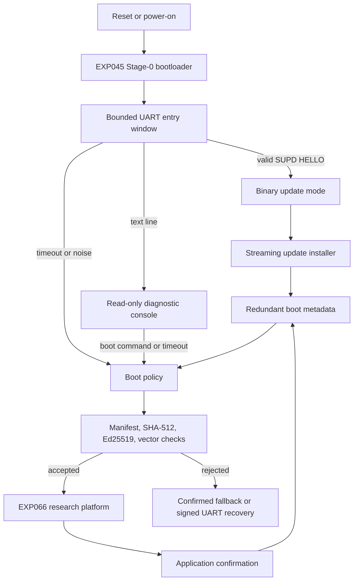

# STM32 Security Lab

**A reproducible STM32F429 secure-boot and embedded-security reference
laboratory with authenticated firmware, rollback-aware A/B updates, runtime
diagnostics, and hardware-in-the-loop validation.**

<p align="center">
  
</p>

> **Status:** hardware validated at RDP Level 0 on an STM32F429IGT6-class board<br>
> **Target platform:** STM32F429 family, `stm32f429_1m` layout profile<br>
> **License:** BSD 3-Clause<br>
> **Primary focus:** defensive embedded-security research and reviewable
> reference code

## Project Goal

STM32 Security Lab is a controlled research repository for studying how secure
boot, signed firmware, update state, rollback policy, flash behavior, runtime
diagnostics, and hardware recovery interact on real STM32F429 hardware.

The repository is intended to be understandable and reproducible for a new
developer. It is not a certified production boot chain, but the current
EXP045/EXP066 secure-boot and secure-update path has been tested on real
hardware at RDP Level 0 and is suitable as an open reference implementation for
review, experimentation, and further hardening.

Only run destructive tests on hardware you own or are explicitly authorized to
test.

## Architecture At A Glance



The trusted bootloader verifies a slot-linked signed image before jumping to
the application. Updates are streamed over the UART binary protocol into the
inactive slot, verified from flash, committed as `CANDIDATE_READY`, trial
booted, and confirmed by the application only after its health gate passes.

Detailed architecture:

- [Secure Boot Architecture](docs/architecture.md)
- [Memory Layout](docs/memory_layout.md)
- [Stage-0 Slot Selection And Trial Boot](docs/stage0_slot_selection.md)
- [Secure Update Streaming Design](docs/secure-update-streaming-design.md)
- [UART Binary Update Protocol](docs/uart-binary-protocol.md)
- [Runtime Security Monitor](docs/runtime-monitor.md)

## Feature Overview

Current release-quality reference components:

- EXP045 Stage-0 secure bootloader for STM32F429.
- EXP066 slot-aware research application.
- Canonical signed-image header with Ed25519 manifest authentication.
- SHA-512 payload integrity verification.
- Redundant boot metadata with explicit states.
- Slot A/Slot B boot selection, trial boot, confirmation, and fallback.
- Persistent three-attempt trial policy, reset-cause accounting, independent
  watchdog and signed UART recovery bootstrap.
- Streaming secure-update installer with fixed RAM buffers and no heap.
- USART1 polling RX/TX transport and deterministic `SUPD` binary protocol.
- Read-only UART diagnostic console.
- `stm32ctl` Python host client for `info`, `status`, `update`, `recovery`, and
  `reset`.
- Runtime Security Monitor foundation in EXP066.
- Cortex-M4 MPU policy with Stage-0/metadata read-only mapping and stack guard.
- Explicit root-of-trust, key lifecycle, rollback, WRP evaluation, and threat
  model documentation.
- Deterministic build checker, release artifact validation, host tests, and HIL
  tooling.

Research or experimental components:

- EXP067-EXP070 module-package, VM, native-loader, and atomic-install
  simulations.
- Runtime-monitor telemetry intended for evidence and diagnostics, not as an
  isolated security enclave.
- Physical recovery pin selection, option-byte policy, WRP/RDP provisioning, and
  fault-injection campaigns.

Recovery and watchdog evidence is explicitly classified in
[the hardening report](docs/recovery-watchdog-hardening-report.md). The
repository distinguishes `IMPLEMENTED`, `HOST TESTED`, `HARDWARE VALIDATED`,
`DOCUMENTED ONLY` and `NOT IMPLEMENTED`; a host test is not hardware evidence.

Part-2 security references:

- [Security Model](docs/security-model.md)
- [Threat Model](docs/threat-model.md)
- [Root of Trust](docs/root-of-trust.md)
- [Root-of-Trust Hardening Report](docs/root-of-trust-hardening-report.md)
- [Root-of-Trust Hardware Evidence](docs/root-of-trust-hardware-validation.md)
- [Key Management](docs/key-management.md)
- [MPU Policy](docs/mpu-policy.md)
- [Root-of-Trust Hardening Report](docs/root-of-trust-hardening-report.md)

## Main Components

| Component | Path | Purpose |
|---|---|---|
| Bootloader | `firmware/exp045_bootloader_v2` | Trusted Stage-0 verifier, boot policy, update mode, diagnostic console |
| Application | `firmware/exp066_research_platform_core` | Slot-linked research platform, RSM, confirmation, LED heartbeat |
| Shared layout | `config/`, `firmware/common/` | Generated STM32F429 flash and linker layout |
| Update package tool | `tools/update_package.py` | Build, inspect, verify, and simulate update packages |
| UART host client | `tools/stm32ctl/` | Host-side client for the bootloader binary protocol |
| Factory metadata tool | `tools/boot_metadata_provision.c` | Create initial redundant `CONFIRMED` metadata records |
| HIL framework | `tools/secure_boot_hil/` | Secure-boot hardware-in-the-loop campaign tooling |
| Tests | `tests/` | Python tests and C host tests for verifier, update, UART, RSM, and tools |
| Documentation | `docs/` | Architecture, validation, release, hardware, and research boundaries |

## Repository Structure

```text
.
|-- config/                 Source memory-layout profile
|-- docs/                   Architecture, validation, release, and research docs
|-- firmware/               Bootloader, application, and experiment firmware
|-- hardware/               Curated hardware baselines and provisioning records
|-- logs/                   Historical experiment evidence
|-- modules/                Module-research examples and fixtures
|-- scripts/                Experiment helper scripts
|-- tests/                  Python and C host tests
|-- third_party/            Vendored dependencies and license notices
|-- tools/                  Signing, update, release, HIL, and host tools
|-- CHANGELOG.md
|-- CONTRIBUTING.md
|-- SECURITY.md
|-- CITATION.cff
`-- README.md
```

The numbered `expNNN_*` directories preserve the research history. The current
hardware-validated secure-update path is EXP045 plus EXP066.

## Hardware

The validated target is an STM32F429IGT6-class board with:

- ST-LINK-compatible SWD probe.
- USART1 on PA9 TX and PA10 RX, 115200 baud, 8N1, 3.3 V TTL.
- Active-low LEDs on LED1 PE3, LED2 PH10, LED3 PH11, LED4 PH12.
- RDP Level 0 for the published hardware-validation evidence.

Use crossed UART wiring:

```text
STM32 PA9 / USART1_TX  -> USB-UART RXD
STM32 PA10 / USART1_RX <- USB-UART TXD
GND                    -> USB-UART GND
```

Do not connect a 5 V serial adapter to the MCU pins. Do not change RDP or
Option Bytes unless a separate, reviewed provisioning procedure explicitly
requires it.

More detail:

- [Hardware Platform](docs/hardware-platform.md)
- [Secure Update Hardware Test Plan](docs/secure-update-hardware-test.md)
- [Hardware Validation Status](docs/release-readiness.md)

## Prerequisites

Typical Linux host tools:

```text
arm-none-eabi-gcc
arm-none-eabi-binutils
make
python3
python3-venv
openocd or stlink-tools
```

Python dependencies are listed in [requirements.txt](requirements.txt):

```bash
python3 -m venv .venv-hil
. .venv-hil/bin/activate
python -m pip install --upgrade pip
python -m pip install -r requirements.txt
python -m pip install -e tools/secure_boot_hil[dev]
```

The repository never requires a private signing seed to run ordinary host
tests. Building signed release packages requires an external 32-byte Ed25519
signing seed supplied by path; private seeds must remain outside Git.

## Build

Build the bootloader:

```bash
make -C firmware/exp045_bootloader_v2 clean all report LAYOUT_PROFILE=stm32f429_1m
```

Build the EXP066 application for the default slot:

```bash
make -C firmware/exp066_research_platform_core clean all LAYOUT_PROFILE=stm32f429_1m
```

Build Slot A and Slot B signed update releases:

```bash
make -C firmware/exp066_research_platform_core slot-releases \
  LAYOUT_PROFILE=stm32f429_1m \
  SIGNING_SEED=/path/to/release_signing_seed.bin \
  PUBLIC_KEY_HEADER=../exp045_bootloader_v2/src/firmware_public_key.h
```

The default EXP066 package image version is `2`. Those packages are suitable
for factory provisioning or offline verification. A positive UART update from
an already confirmed version-2 slot must use a strictly higher package version,
otherwise rollback protection rejects it as a same-version update.

The current `stm32f429_1m` slot bases are:

| Region | Address |
|---|---:|
| Bootloader | `0x08000000` |
| Metadata A | `0x08008000` |
| Metadata B | `0x0800c000` |
| Slot A signed image | `0x08020000` |
| Slot A payload/vector base | `0x08020200` |
| Slot B signed image | `0x08080000` |
| Slot B payload/vector base | `0x08080200` |

The generated layout files are the authority for code and linker scripts.

## Flashing

Flashing is intentionally manual. Review every address before writing:

```bash
st-flash write firmware/exp045_bootloader_v2/build/exp045_bootloader_v2.bin 0x08000000
st-flash write firmware/exp066_research_platform_core/build/slot_a/exp066_research_platform_core_slot_a_slot_a_update_v2.bin 0x08020000
```

Create initial confirmed metadata:

```bash
make -C tools boot-metadata-provision
mkdir -p build/factory
tools/build/boot_metadata_provision.bin create-confirmed \
  --slot a \
  --image-version 2 \
  --sector-image \
  --copy-a-output build/factory/boot_metadata_a.bin \
  --copy-b-output build/factory/boot_metadata_b.bin \
  --json-output build/factory/boot_metadata_provision.json
st-flash write build/factory/boot_metadata_a.bin 0x08008000
st-flash write build/factory/boot_metadata_b.bin 0x0800c000
```

The factory flow is documented in
[Factory Provisioning Workflow](docs/factory_provisioning.md). It does not
write Option Bytes, RDP, WRP, OTP, or any irreversible configuration.

## Tests

Run all Python tests:

```bash
PYTHONDONTWRITEBYTECODE=1 python3 -m pytest -q -p no:cacheprovider tests
```

Run C host tests:

```bash
make -C tests/host_verifier clean test
make -C tests/update_storage clean test
make -C tests/update_protocol clean test
make -C tests/uart clean test
make -C tests/diagnostic_console clean test
make -C tests/rsm_core clean test
make -C tests/reset_cause clean test
make -C tools clean test
```

Run sanitizer variants where supported:

```bash
make -C tests/host_verifier clean test SANITIZE=1
make -C tests/update_storage clean test SANITIZE=1
make -C tests/update_protocol clean test SANITIZE=1
make -C tests/uart clean test SANITIZE=1
make -C tests/diagnostic_console clean test SANITIZE=1
make -C tools clean test SANITIZE=1
```

Run release checks:

```bash
.venv-hil/bin/ruff check .
.venv-hil/bin/mypy tools/stm32ctl tests/test_stm32ctl.py
python3 tools/check_deterministic_build.py
python3 tools/check_no_private_keys.py
bash audit/run_repository_audit.sh
git diff --check
```

The GitHub CI workflow runs the same host, firmware, deterministic-build, and
private-key checks without flashing hardware.

## Secure Boot

The bootloader accepts an image only when all of the following checks pass:

- canonical little-endian v2 manifest;
- supported target compatibility and application image type;
- image version allowed by policy;
- payload range inside the selected slot;
- initial MSP inside supported SRAM and 8-byte aligned;
- Thumb reset vector inside the authenticated payload;
- SHA-512 payload digest match;
- Ed25519 signature over the serialized manifest;
- final jump-context revalidation before `VTOR`, `MSP`, and branch.

Any malformed, corrupted, unsigned, downgraded, or structurally invalid image is
rejected before execution.

See [Secure Boot Validation](docs/secure_boot_validation.md) and
[Threat Model](docs/threat_model.md).

## Secure Update

The update chain keeps the full package out of RAM. The host sends the package
through the `SUPD` UART binary protocol in bounded frames. The target:

1. validates the header and signature before erasing the inactive slot;
2. checks rollback policy before writing;
3. commits `WRITING` metadata before candidate-slot erase;
4. writes monotonic payload blocks only at the expected offset;
5. keeps a streaming SHA-512 state during transfer;
6. reads the installed image back from flash;
7. verifies the installed manifest, signature, payload hash, padding, and
   vector table;
8. commits `CANDIDATE_READY` only after final verification;
9. resets into the trial-boot path.

Host update example:

```bash
PYTHONPATH=tools python3 -m stm32ctl \
  --port /dev/ttyUSB0 \
  --timeout 15 \
  update \
  --package firmware/exp066_research_platform_core/build/slot_b/exp066_research_platform_core_slot_b_slot_b_update_v2.bin \
  --public-key-header firmware/exp045_bootloader_v2/src/firmware_public_key.h \
  --block-size 512
```

If the active confirmed image is version `2`, first build a higher-version
candidate package from the already slot-linked binary:

```bash
python3 tools/update_package.py build \
  --application firmware/exp066_research_platform_core/build/slot_b/exp066_research_platform_core_slot_b.bin \
  --seed firmware/exp065_signed_app/keys/firmware_signing_seed.bin \
  --slot b \
  --image-version 3 \
  --output build/exp066_slot_b_v3_update_v2.bin \
  --json-output build/exp066_slot_b_v3_package_build.json

python3 tools/update_package.py verify \
  --package build/exp066_slot_b_v3_update_v2.bin \
  --slot b \
  --application firmware/exp066_research_platform_core/build/slot_b/exp066_research_platform_core_slot_b.bin \
  --public-key-header firmware/exp045_bootloader_v2/src/firmware_public_key.h \
  --json-output build/exp066_slot_b_v3_package_verify.json
```

See [stm32ctl](docs/stm32ctl.md),
[UART Binary Update Protocol](docs/uart-binary-protocol.md), and
[Secure Update Audit](docs/secure-update-audit.md).

## Runtime Security Monitor

EXP066 includes a Runtime Security Monitor foundation. It reports public
diagnostic evidence such as device family, flash size, reset cause, boot slot,
health state, vector-monitor status, and event counters. Restricted diagnostics
are disabled by default and must never be treated as authentication.

Normal `HEALTHY` state uses a non-blocking LED4 heartbeat: 100 ms on, 900 ms
off at the current health-service tick rate. Warning and fatal states use
distinct patterns.

See [Runtime Security Monitor](docs/runtime-monitor.md),
[EXP066 CLI](docs/cli-reference.md), and
[EXP071 Platform Integration](docs/exp071-platform-integration.md).

## Hardware Validation Status

Validated on real hardware at RDP Level 0:

- secure boot from Slot A;
- SHA-512 and Ed25519 execution before application jump;
- slot selection and application handoff;
- application confirmation;
- A-to-B update to Slot B;
- B-to-A update to Slot A;
- rollback rejection for same and lower versions;
- fail-closed rejection of corrupted manifest, target, signature, and payload;
- UART CRC, sequence, partial-frame, and random-byte negative cases;
- flash readback for positive update targets;
- unchanged Option Bytes during the campaign.

Part 2 additionally recorded hardware evidence for the complete `mpu_*`
scenario matrix, IWDG trial reset/fallback, wrong-key/signature/manifest
rejection, and the corrected confirmed-version rollback floor. A fully
debugger-free reset campaign remains open.

Host-only validation covers parser boundaries, verifier edge cases, metadata
transitions, deterministic build reproducibility, package verification, and
tool behavior.

Not claimed by the current release:

- RDP2 readiness;
- production key custody or HSM-backed signing;
- hardware-backed monotonic rollback counters;
- physical recovery input;
- certified fault-injection or side-channel resistance;
- production remote-update authorization beyond signed firmware packages.

See [Hardware Validation Status](docs/release-readiness.md) and
[Validation Summary](docs/validation-summary.md).

## Release Process

Release preparation consists of:

1. clean host tests and C host tests;
2. deterministic build comparison;
3. private-key scan;
4. bootloader and Slot A/Slot B package verification;
5. hardware-validation evidence for firmware or update-path changes;
6. documentation and changelog review;
7. annotated tag and GitHub release only after CI is green.

Do not overwrite existing tags. If the previous tag exists, use the next patch
tag.

See [Release Process](docs/release_process.md),
[Release Checklist](docs/RELEASE_CHECKLIST.md), and
[Changelog](CHANGELOG.md).

## Troubleshooting

| Symptom | Likely cause | Check |
|---|---|---|
| `stm32ctl` timeout during update begin | Candidate-slot erase takes several seconds | Use `--timeout 15` or higher on real hardware |
| `Slot decision = NONE` | Missing or invalid metadata | Recreate and flash both metadata copies |
| SHA-512 or Ed25519 timing is `0 us` | Boot policy never selected an image | Inspect metadata and slot addresses |
| Signature verification fails offline | Wrong public key or stale package report | Run `update_package.py verify` with current package hash |
| App does not confirm trial boot | EXP066 did not reach the health gate | Use console `metadata`, `confirmation status`, and UART logs |
| UART binary mode prints text | Entry classification failed or a terminal sent text | Reset and send a valid binary `HELLO` first |
| ST-LINK write/read fails intermittently | Probe, USB, or target-state issue | Reconnect, reset target, and compare readback before debugging firmware |

## FAQ

**Is this production ready?**
No. The secure-boot/update path is a hardware-validated research reference, not
a certified product. Production use needs independent security review, key
management, recovery policy, option-byte provisioning, and lifecycle design.

**Does the repository contain a production signing key?**
No. Private signing seeds and keys must remain outside Git. The committed public
key header is not secret.

**Can I enable RDP2?**
No release document approves RDP2. RDP2 may be irreversible and is blocked until
physical recovery and provisioning procedures are independently validated.

**Can the host choose the update slot?**
No. The host sends a signed package. The bootloader determines the inactive
candidate slot from confirmed metadata and rejects mismatches.

**Why is the signature over the manifest instead of the full payload?**
The manifest contains the SHA-512 digest of the payload. Ed25519 authenticates
the canonical manifest; SHA-512 binds the payload bytes to that signed
manifest.

**Why are some old experiment files still present?**
The repository preserves numbered experiments as research history. Current
release behavior is described by the EXP045, EXP066, `docs/`, `tools/`, and
`tests/` paths linked above.

## Known Limitations

- No certified fault-injection, glitch, or side-channel resistance claim.
- No production manufacturing key ceremony, rotation, revocation, or HSM flow.
- No hardware-backed monotonic anti-rollback counter.
- No physical recovery GPIO is selected in the repository.
- No automatic Option Byte, WRP, RDP, or OTP provisioning.
- No production remote-update authorization layer beyond signed packages and
  rollback policy.
- Physical power-removal timing should be repeated for each board and power
  setup before irreversible provisioning.

See [Limitations](docs/limitations.md).

## Roadmap

Short-term review work:

- keep documentation, release notes, and hardware evidence current;
- repeat physical power-removal tests with controlled target power;
- add board-revision-specific LED and timing observations where available;
- harden recovery entry and provisioning procedures before any RDP planning.

Longer-term research:

- hardware-backed rollback or monotonic policy storage;
- write-protection and option-byte lifecycle studies;
- physical fault-injection and brownout campaigns on expendable boards;
- deeper Runtime Security Monitor evidence and boot mailbox design;
- reviewed production key-custody model.

See [Research Roadmap](docs/RESEARCH_ROADMAP.md).

## Responsible Use

The repository is published to support defensive research, education,
reproducibility, and peer review. Users are responsible for complying with
applicable law, device ownership requirements, contractual restrictions, and
laboratory safety procedures.

## Contributing

See [Contributing](CONTRIBUTING.md). Security reports should follow
[Security Policy](SECURITY.md).

## License

Project-authored content is distributed under the
[BSD 3-Clause License](LICENSE). Third-party components remain under their
respective licenses.

## Citation

Citation metadata is provided in [CITATION.cff](CITATION.cff).

## Author

STM32 Security Lab is an independent embedded-security research project created
and maintained by Mathias Zimmermann. AI tools were used during development for
documentation editing, refactoring suggestions, test generation, and code
review; system architecture, implementation decisions, debugging, hardware
validation, and final integration were performed manually on real STM32
hardware.
