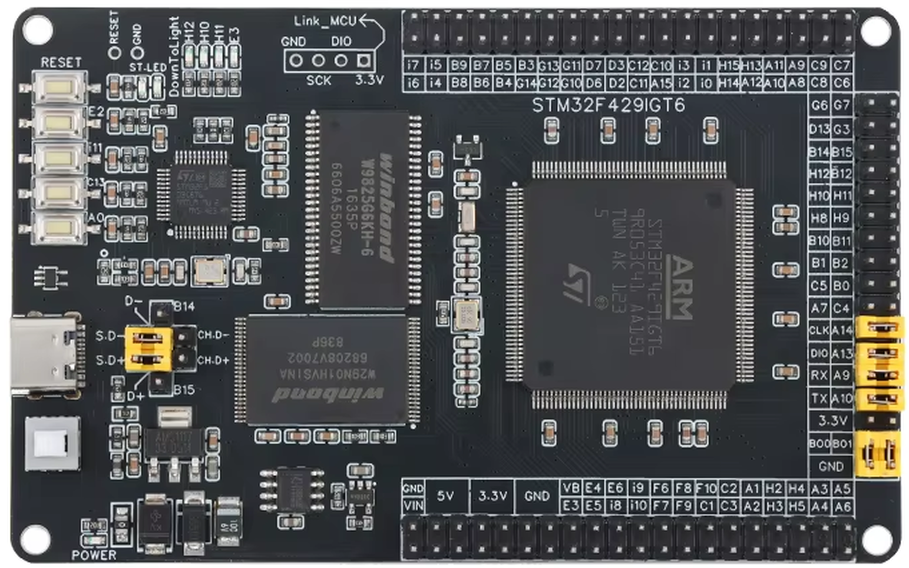
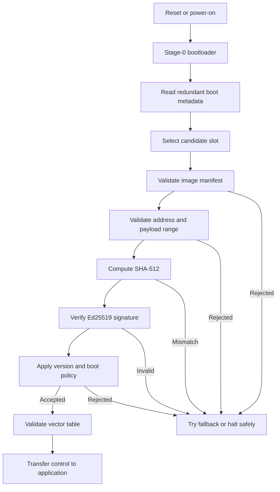
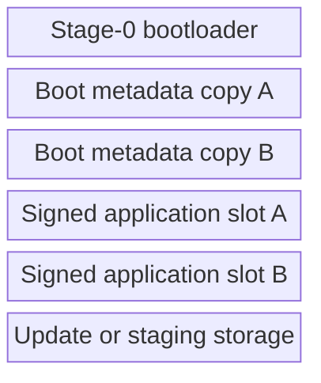

# STM32 Security Lab

**A reproducible STM32F429 secure-boot and embedded-security research platform with authenticated firmware, rollback-aware slot selection, controlled recovery, and automated hardware-in-the-loop validation.**

<p align="center">
  
</p>

> **Research status:** hardware validated<br>
> **Target platform:** STM32F429 family<br>
> **License:** BSD 3-Clause
> **Primary focus:** defensive embedded-security research

## Overview

STM32 Security Lab is a research-oriented firmware and tooling repository for
studying secure boot, authenticated firmware installation, boot metadata,
rollback policy, recovery behavior, debug access, memory protection, and
hardware fault response on STM32 microcontrollers.

The repository combines:

- a stage-0 secure bootloader;
- signed application images;
- SHA-512 integrity verification;
- Ed25519 authentication;
- redundant boot metadata;
- A/B application slots;
- update and recovery tooling;
- deterministic host-side verification;
- automated hardware-in-the-loop testing;
- documented security experiments and observations.

The project is designed as a reproducible laboratory environment rather than
as a vendor product or certified production boot chain.

## Why this project exists

The project originated from defensive embedded-security research into how
firmware trust, protection state, debug access, memory contents, and fault
behavior interact on real microcontrollers.

A secure boot chain was implemented first to establish a known and measurable
security baseline. This baseline makes later experiments more meaningful:
changes in boot behavior, memory state, authentication decisions, update
handling, and protection settings can be compared against a controlled
reference implementation.

The STM32F429 family was selected as an accessible and capable research
platform for understanding the architecture, flash organization, boot process,
debug infrastructure, and protection mechanisms of the family. The resulting
methods and tooling are intended to support future work on closely related
STM32F429 variants, including the STM32F429VET6 target that motivated the
broader investigation.

The long-term research direction includes controlled analysis of:

- fault injection and glitch response;
- unauthorized or malformed firmware loading attempts;
- protection-state transitions;
- read-out protection behavior;
- boot-chain corruption and recovery;
- changes to memory and device state caused by security configuration;
- observable behavior at and around the microcontroller during invasive tests.

Only hardware owned by or explicitly entrusted to the researcher should be
used for these experiments.

## Security goals

The implemented platform is designed to demonstrate and test the following
properties:

1. **Authenticity** — only images signed by an authorized key are accepted.
2. **Integrity** — image contents are verified before execution.
3. **Manifest validation** — malformed sizes, addresses, versions, and ranges
   are rejected before use.
4. **Safe failure** — invalid images do not receive control.
5. **Redundant metadata** — boot decisions tolerate an invalid metadata copy.
6. **Rollback control** — version policy can prevent booting older images.
7. **Recovery** — failed tests restore the device to a verified baseline.
8. **Reproducibility** — host tests and HIL tests document observable results.

## Hardware platform

The current implementation targets an STM32F429 development board built around
an STM32F429IGT6-class device and is tested through an ST-LINK-compatible SWD
debug interface.

### Required equipment

- STM32F429 development board;
- ST-LINK-compatible programmer/debugger;
- USB-to-UART interface when the board does not expose one directly;
- Linux development host;
- ARM GNU toolchain;
- OpenOCD and/or `st-flash`;
- Python 3 for host tooling and HIL orchestration.

Board-specific wiring, interfaces, and component notes are documented in
[`docs/hardware-platform.md`](docs/hardware-platform.md).

## Architecture



A detailed description is available in
[`docs/architecture.md`](docs/architecture.md).

## Flash organization

The repository uses a generated and centrally defined flash layout. The exact
addresses remain source-controlled in:

- `config/stm32f429_memory_layout.json`
- `firmware/common/stm32f429_memory_layout.h`
- `firmware/common/stm32f429_memory_layout.ld`
- `firmware/common/stm32f429_memory_layout.mk`



Do not infer production addresses from this diagram. Use the generated layout
files for the active target configuration.

## Repository structure

```text
.
├── config/                 Generated-source memory layout configuration
├── docs/                   Architecture, threat model, validation, and research notes
├── firmware/               Bootloader, application, and experiment firmware
├── hardware/               Hardware baselines and provisioning records
├── logic/                  Logic-analyzer captures and timing observations
├── logs/                   Curated experiment evidence
├── modules/                Research platform modules and examples
├── scripts/                Reproducible experiment scripts
├── tests/                  Host-side tests
├── third_party/            Vendored dependencies and license notices
├── tools/                  Image, update, verification, and HIL tooling
├── CHANGELOG.md
├── CONTRIBUTING.md
├── LICENSE
├── SECURITY.md
└── README.md
```

The numbered `expNNN_*` directories preserve the research history and make
individual experiments traceable.

## Secure-boot validation

The hardware-in-the-loop framework performs positive and negative tests
against the real target.

Validated classes include:

- accepted authentic image;
- modified payload;
- invalid hash;
- invalid signature;
- malformed manifest fields;
- invalid payload ranges;
- authentication failures;
- metadata and slot-selection behavior;
- backup and restoration of protected flash regions.

The completed validation campaign produced:

| Result | Count |
|---|---:|
| PASS | 15 |
| FAIL | 0 |
| ERROR | 0 |
| SKIP | 0 |
| Restore verified | Yes |

The HIL runner verified restoration of the bootloader, metadata copies, slot A,
and slot B after the campaign.

Detailed test strategy and report semantics are documented under
`tools/secure_boot_hil/docs/`.

## Quick start

### 1. Clone and enter the repository

```bash
Clone the repository using its GitHub page or an existing Git remote, then enter the working tree:

```bash
cd stm32-security-lab
```

### 2. Install host dependencies

Use the package manager appropriate for the development host. Typical tools
include:

```text
arm-none-eabi-gcc
arm-none-eabi-binutils
make
python3
python3-venv
openocd
stlink-tools
```

### 3. Create the Python environment

```bash
python3 -m venv .venv-hil
. .venv-hil/bin/activate
python -m pip install --upgrade pip
python -m pip install -r requirements.txt
python -m pip install -e tools/secure_boot_hil
```

### 4. Run host-side tests

```bash
python -m pytest
python -m ruff check .
```

### 5. Build the bootloader and application

```bash
make -C firmware/exp045_bootloader_v2 clean all
make -C firmware/exp066_research_platform_core clean all
```

### 6. Run hardware-in-the-loop validation

Review the configured serial device, debugger, image paths, and target flash
layout before running any hardware operation.

```bash
./run_hil_regression.sh
```

The HIL runner can erase and rewrite flash. It should only be used with a
recoverable target and verified backups.

## Safety and authorization

This repository includes operations that can:

- erase or overwrite internal flash;
- modify boot metadata;
- change option bytes;
- alter read-out or write protection;
- disable normal debug access;
- leave a target temporarily unbootable;
- permanently restrict access when irreversible protection is enabled.

Do not perform these actions on devices that you do not own or have explicit
authorization to test.

RDP Level 2 may be irreversible. Consult the authoritative device
documentation before changing protection settings.

## Threat model

The project evaluates a software-controlled boot chain under a defined
research threat model. It does not claim resistance against every physical
attacker.

Included concerns:

- unsigned or incorrectly signed firmware;
- modified payloads;
- malformed manifests;
- invalid addresses and lengths;
- stale firmware versions;
- corrupted metadata;
- interrupted update installation;
- unexpected reset and recovery paths.

Out of scope for the current validated baseline:

- certified resistance to voltage, clock, electromagnetic, or laser fault injection;
- side-channel resistance certification;
- secure key storage backed by a dedicated hardware root of trust;
- production provisioning at manufacturing scale;
- formal verification of the complete boot chain;
- resistance to decapsulation or invasive silicon analysis.

See [`docs/threat_model.md`](docs/threat_model.md) and
[`docs/limitations.md`](docs/limitations.md).

## Research workflow

The repository follows a baseline-driven process:

1. capture the initial device state;
2. implement one controlled security mechanism;
3. verify expected positive behavior;
4. inject negative and malformed cases;
5. record UART, debugger, memory, and timing observations;
6. restore the target;
7. verify the restored state;
8. document residual uncertainty.

This approach is intended to separate observed hardware behavior from
assumptions and to make later fault-injection work measurable.

## Reproducibility

Reproducibility is supported through:

- centrally generated memory-layout definitions;
- deterministic build checks;
- host-side image verification;
- explicit negative tests;
- flash-region backup and comparison;
- machine-readable HIL reports;
- preserved experiment scripts;
- documented tool versions and test conditions.

Transient ST-LINK or USB failures may occur during repeated flashing. Such
transport failures are reported separately from secure-boot test failures and
should be evaluated using the captured command output.

## Limitations

This is a research platform, not a drop-in production bootloader.

Before production use, an independent engineering and security review would
still be required, including:

- key-management design;
- manufacturing provisioning;
- lifecycle and revocation policy;
- hardware-specific fault analysis;
- recovery authorization;
- secure update transport;
- production logging policy;
- formalized compatibility and migration guarantees.

## Documentation

Start with:

- [`docs/project-motivation.md`](docs/project-motivation.md)
- [`docs/hardware-platform.md`](docs/hardware-platform.md)
- [`docs/architecture.md`](docs/architecture.md)
- [`docs/threat_model.md`](docs/threat_model.md)
- [`docs/secure_boot_validation.md`](docs/secure_boot_validation.md)
- [`docs/validation-summary.md`](docs/validation-summary.md)
- [`tools/secure_boot_hil/README.md`](tools/secure_boot_hil/README.md)

## Responsible use

The repository is published to support defensive research, education,
reproducibility, and peer review. Users are responsible for complying with
applicable law, device ownership requirements, contractual restrictions, and
laboratory safety procedures.

## Contributing

See [`CONTRIBUTING.md`](CONTRIBUTING.md).

Security reports should follow [`SECURITY.md`](SECURITY.md).

## License

Project-authored content is distributed under the
[BSD 3-Clause License](LICENSE).

Third-party components remain under their respective licenses.

## Citation

Citation metadata is provided in [`CITATION.cff`](CITATION.cff).

## Author

**Mathias Zimmermann**

STM32 Security Lab is an independent embedded security research project
created and maintained by Mathias Zimmermann.

The project documents practical research on secure boot, authenticated
firmware updates and embedded security on STM32F429 devices.

## Development

This repository was developed by Mathias Zimmermann.

AI tools were used during development for documentation editing,
refactoring suggestions, test generation and code review.

System architecture, implementation decisions, debugging, hardware
validation and final integration were performed manually on real STM32
hardware.
