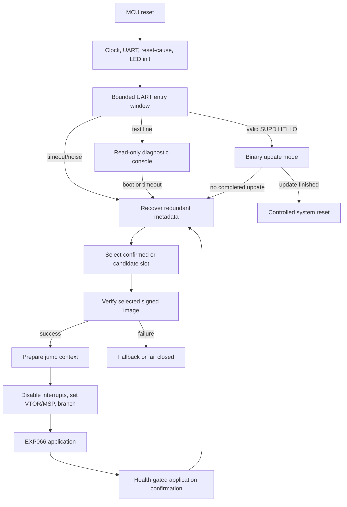
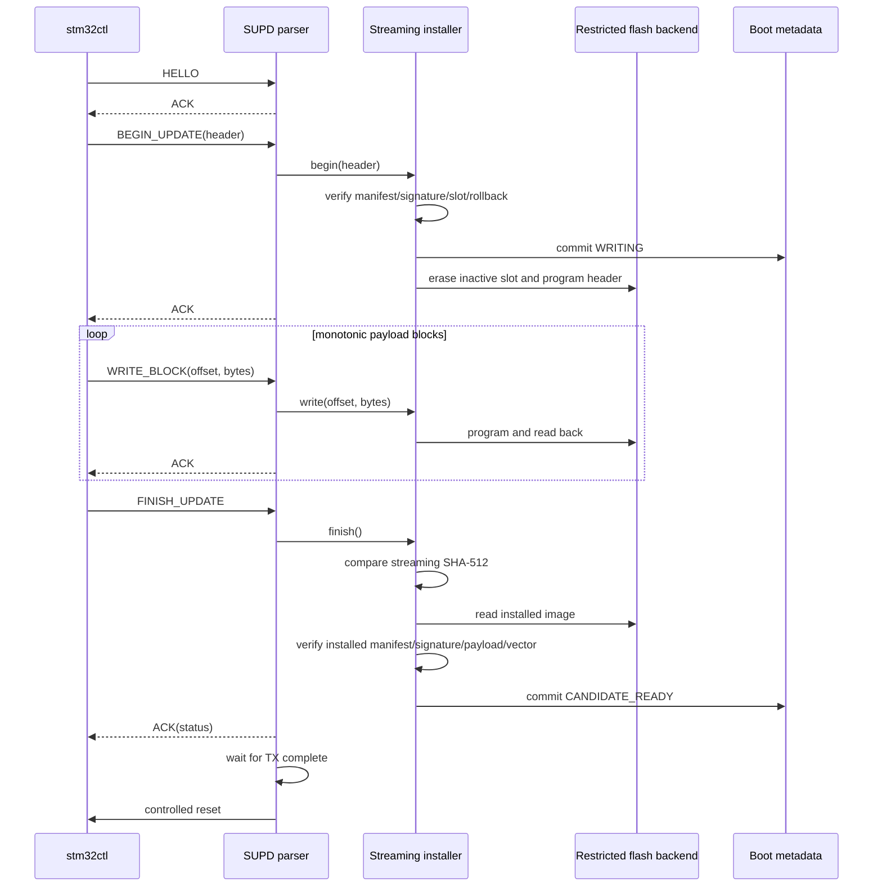

# Secure Boot And Update Architecture

## Overview

STM32 Security Lab separates the trusted Stage-0 bootloader from the EXP066
research application.

The bootloader is the trusted computing base. It owns image authentication,
slot selection, rollback-aware update state, and the final jump to the
application. The application is treated as untrusted until its selected slot has
passed all configured checks.

## Trust Boundary

- The EXP045 bootloader is trusted code.
- The embedded Ed25519 public key is trusted input.
- The host-side private signing seed is never stored in committed source.
- Boot metadata guides state transitions but is not an authenticity mechanism.
- EXP066 runtime diagnostics and RSM output are evidence, not attestation.

## Boot Flow



The normal boot path is bounded: UART noise or missing input cannot keep the
bootloader in the entry window forever.

## Secure-Boot Verification

Stage 0 verifies a slot only when metadata selects a concrete candidate or
confirmed slot. The verifier checks:

1. manifest magic;
2. header version;
3. image version policy;
4. target compatibility;
5. image type;
6. supported flags and canonical fields;
7. payload size and overflow-safe slot bounds;
8. initial MSP range and 8-byte alignment;
9. Thumb reset vector inside the accepted payload;
10. SHA-512 payload digest;
11. Ed25519 signature over the serialized manifest;
12. redundant pre-jump context validation and flash vector re-read.

If any check fails, the selected image is rejected before execution.

## Signed Image Layout

Each slot starts with a fixed 512-byte signed-image header:

| Offset | Size | Field |
|---:|---:|---|
| `0x000` | 96 | Little-endian signed manifest |
| `0x060` | 64 | Ed25519 signature over the manifest |
| `0x0a0` | 352 | Header padding, all `0xff` |
| `0x200` | `image_size` | Application payload and vector table |

The signature authenticates the manifest. The manifest contains the SHA-512
digest that binds the payload bytes to the signed metadata.

## Slot Layout

The generated `stm32f429_1m` profile is authoritative:

| Region | Address range |
|---|---|
| Bootloader | `0x08000000`-`0x08007fff` |
| Boot metadata copy A | `0x08008000`-`0x0800bfff` |
| Boot metadata copy B | `0x0800c000`-`0x0800ffff` |
| Update metadata | `0x08010000`-`0x0801ffff` |
| Slot A signed image | `0x08020000`-`0x0807ffff` |
| Slot A payload base | `0x08020200` |
| Slot B signed image | `0x08080000`-`0x080dffff` |
| Slot B payload base | `0x08080200` |
| Reserved recovery | `0x080e0000`-`0x080fffff` |

Source of truth:

- `config/stm32f429_memory_layout.json`
- `firmware/common/stm32f429_memory_layout.h`
- `firmware/common/stm32f429_memory_layout.ld`
- `firmware/common/stm32f429_memory_layout.mk`

## Metadata And Rollback

Boot metadata is stored redundantly. Each copy is a fixed-size record with CRC
and a final commit marker. Torn writes without the commit marker are not
selected.

The current lifecycle is:

```text
CONFIRMED -> WRITING -> CANDIDATE_READY -> PENDING_TRIAL -> CONFIRMED
                                  |              |
                                  v              v
                            REJECTED_INVALID  REJECTED_INVALID
```

Rollback protection is enforced before candidate erase: an update candidate
must advance beyond the confirmed image version recorded in metadata. Same and
lower versions are rejected.

Hardware-backed monotonic counters are not implemented; rollback state is still
metadata-backed and depends on Stage 0 remaining the trusted writer.

## Secure Update Flow



The host never supplies raw flash addresses or the target slot. It supplies a
signed update package. Stage 0 determines the inactive slot from confirmed
metadata and rejects packages whose manifest targets the wrong slot.

## Recovery Behavior

The current recovery behavior is fail-closed:

- no valid metadata means no guessed boot slot;
- `WRITING` and `REJECTED_INVALID` do not boot the candidate;
- a candidate is not bootable until `CANDIDATE_READY` is committed;
- `CANDIDATE_READY` is verified again before trial boot;
- missing confirmation eventually falls back to the last confirmed slot.

No physical recovery GPIO is selected yet. The repository documents no
definitive spare pin for that purpose. Option Bytes, WRP, RDP, and OTP are not
changed automatically.

## Runtime Security Monitor

EXP066 contains a Runtime Security Monitor foundation. It observes the running
application state, vector-table consistency, reset cause, slot context, health
state, and event counters. It does not make firmware trusted and does not
change Stage-0 boot decisions.

## Fail-Safe Behavior

The boot chain is deny-by-default:

- malformed images fail closed;
- invalid signatures fail closed;
- payload-hash mismatches fail closed;
- version rollback fails closed;
- incorrect slot binding fails closed;
- partially written candidates are not marked ready;
- failed final jump-context validation returns to the common halt path.

This is defensive validation evidence. It is not a certification of resistance
to physical fault injection, glitching, side channels, or invasive attacks.
