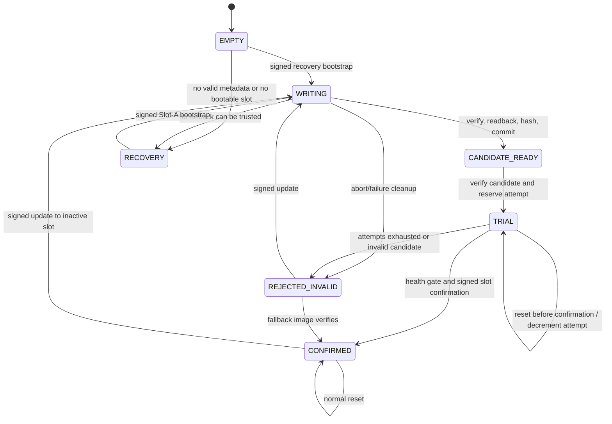

# Boot recovery state machine

Status: IMPLEMENTED, HOST TESTED. Hardware evidence is recorded separately in
`docs/recovery-watchdog-hardening-report.md`.

The bootloader uses `PENDING_TRIAL` as the stored representation of the
semantic `TRIAL` state. Stage-0 always verifies the signed image before a jump.
The active/confirmed slot is never erased by an update to the inactive slot.

## States and policy

| State | Meaning | Reset behavior | Allowed next state |
|---|---|---|---|
| `EMPTY` | No provisioned image is trusted | Do not jump; enter UART recovery | `WRITING` |
| `WRITING` | Update metadata is committed before erase/program | Keep the confirmed `active_slot`, if any; never jump the candidate | `CANDIDATE_READY`, `REJECTED` |
| `CANDIDATE_READY` | Complete image has passed package, signature, hash and readback checks | Verify candidate, then make it `TRIAL` | `TRIAL`, `REJECTED` |
| `TRIAL` (`PENDING_TRIAL`) | Candidate may boot; `boot_attempt_count` is remaining budget | Verify candidate; decrement budget on each unconfirmed reset | `TRIAL`, `CONFIRMED`, `REJECTED` |
| `CONFIRMED` | Active slot is the trusted fallback | Verify and boot only `active_slot` | `WRITING`, `CONFIRMED` |
| `REJECTED` (`REJECTED_INVALID`) | Candidate is not eligible for boot | Verify and boot `active_slot`; if absent, recover | `WRITING` |
| `INVALID` | External description for a CRC/format/image failure | Fail closed; do not jump | recovery only |

`MAX_TRIAL_ATTEMPTS` is 3. A candidate-ready record consumes one attempt when
it becomes `TRIAL`; a subsequent unconfirmed reset decrements the persistent
counter. When it reaches zero, the next boot records `REJECTED_INVALID` and
falls back. An IWDG, software, pin, brownout, power-on, low-power or unknown
reset is recorded in `metadata.result` for a pending trial. Resets of a
confirmed slot do not alter its confirmation.

The metadata journal rejects sequence zero and `UINT32_MAX`. It does not wrap
silently: sequence exhaustion is fail-closed. Recovery may explicitly
reinitialize only the two metadata sectors and then bootstrap a signed Slot-A
image. An equal generation with different valid contents is ambiguous and is
not selected automatically.

The application confirms only after platform startup, self-tests, UART
diagnostics, RSM initialization, active IWDG, a stable execution point and the
application health predicate all pass. Confirmation is a metadata commit, not
an implicit jump result.

