# Root-of-trust chain

The chain is deliberately linear and uses the existing Stage-0, dual-slot and
confirmation architecture:

```mermaid
flowchart LR
    R[Reset] --> S0[Stage 0]
    S0 --> PK[Embedded Ed25519 public key]
    PK --> M[Redundant boot metadata]
    M --> MF[Manifest and target slot]
    MF --> H[SHA-512 payload hash]
    H --> SIG[Ed25519 signature over manifest]
    SIG --> V[Vector, MSP, reset and bounds checks]
    V --> VP[Monotone version policy]
    VP --> SEL[Confirmed/candidate slot selection]
    SEL --> T[Trial boot]
    T --> HG[Application health gate]
    HG --> C[Atomic slot confirmation]
    C --> M
```

| Step | Validation | Failure action | Persistent change |
|---|---|---|---|
| Reset/Stage 0 | reset cause, Stage-0 code and layout | boot policy or recovery | none |
| Public key | exact 32-byte compiled key | reject signature | none |
| Metadata | both copies, CRC, commit marker, canonical fields, generation | fallback or recovery | only a safe journal entry |
| Manifest | fixed 96-byte encoding and target fields | reject before erase | none |
| Payload hash | exact bounded payload and SHA-512 | reject candidate | no commit |
| Signature | Ed25519 over the exact manifest | reject candidate | no commit |
| Version | greater than confirmed floor | rollback rejection | no erase |
| Slot selection | active/candidate relation and image verification | confirmed fallback/recovery | trial record only if valid |
| Trial/health | bounded attempts, reset policy, UART/RSM/watchdog/critical checks | decrement/reject | persistent trial state |
| Confirmation | running vector belongs to pending candidate | remain unconfirmed | atomic `CONFIRMED` commit |

No unsigned jump, active-slot erase, Stage-0 write, metadata reset from an
ordinary update, or rollback-floor reset through slot selection is permitted.

The existing field `candidate_image_version` is the compact format's
canonical metadata version: while `CONFIRMED` it is the installed and
rollback-floor version; while a candidate is pending it is the candidate
version. A rejected candidate is not promoted to the floor: the installer
re-verifies the signed manifest of the confirmed active slot before accepting
another update. No second persistent version counter is introduced.
